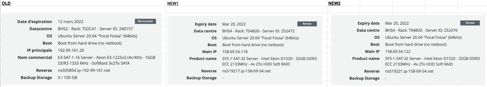

# How To Migrate To A New Server

## Introduction

The purpose of the migration is to get more disk space, and to prove we are
doing the backups correctly.
The idea is that there should be nothing copied from machine to machine.
The purpose here is to only take stuff from the backup storage, and if there's
anything missing, we need to start storing it on the backup storage.
For example: if it proves that the recovery of the DB isn't possible, because
we are missing some configuration file of the DB, we should ensure we're backing
this file up.

### Machine definitions

We have 3 server machines and a 1 backups serivce

| Server | Description | Access |
| --- | ----------- | ---- |
| OLD | Old machine `secprod` | Hazem / Adam |
| CA1 | New machine `sec-ca1` | Hazem / Adam |
| CA1 | New machine `sec-ca2` | Adam |
| BACKUP | NFS appliance at OVH  | Adam / Hazem |

### Diagram

Traffic:
```
  ┌─────────►  BACKUP  ────┐
  │                        │
  │              │         │
  │              │         │
  │              │         │
  │              ▼         ▼
 OLD           NEW1       NEW2

There should be no copying between OLD / NEW1.

```

The NEW2 will be something that Adam will be using to verify that the procedures explained in the docs work.

### Parameters




## Procedure 

### Step 1

Ensure that we have all the necessary data, such as the backups. 

Each backup is in a compressed format. For the Database, we need to extract it and run certain commands to ensure it works fine and is ready to be used. For the Files, we need to extract them and then run a process that compares the files listed as existing in the database and check if they are actually there.

We also need to ensure that the configuration files we have are working properly and are complete for all services we use in the system. (We can test it by running it on a Vagrant machine and ensuring that it works fine.)

### Step 2

We need to ensure that the new server is up and running with the same OS as the previous one to make sure that we do not face any bugs.

If needed, we run the commands in the `soyoustart.sh` file to have more storage on `/mnt/sec` where we will be having all the files and also the database.

We need to ensure that we have a proper disk configuration with LVM, so that we take advantage of the 1x2TB system disk and 3x2TB=6TB data disk storage, mounted on `/mnt/sec` because we will have all the DB and Files in that directory.

The `/mnt/sec/db` will have the database, and as of now, it is 79 GB.

The `/mnt/sec/cache` will have the Index (RSS), ZIP, and Data Files, and it is 

The `/mnt/sec/unzipped_cache` will have the uncompressed content from the ZIP files inside `/mnt/sec/cache`.

### Step 3

Add the IP Address in the Ansible Playbook and run Ansible it on the new server.
This should provision the machine appropriately with the necessary software.

### Step 4

We run a script to copy backup files from BACKUP to NEW1 data disk.
Copying from the storage will ensure we have all the necessary backups in the BACKUP storage.
This should be done with 1 command: `backup_db_sync.sh`  should know how to identify
the latest full backup and sync it somewhere to `/home/backup`.

### Step 5

Since we have Postgres installed after running the Playbook, and we will have
the backup files synced up to `/home/backup` somewhere, we can start the process to restore the database from the backup file we retrieved earlier.
This should be done with a script `backup_db_restore.sh`.

### Step 6

Copy over the SEC Binary and start running tests to ensure everything works fine, these tests include:
- Commands work fine
- Server runs properly
- Database is up and running
- Files can be accessed from the CLI and the website

### Step 7
Configure the DNS to point to the IP Address of the new server.
